<h1 align="center">"TRAEKTORIA" SHOP ANDROID APP TESTING PROJECT</h1>  
<p align="center">
    <a href="https://www.traektoria.ru/">
        
    </a>
</p>

<h2 align="center">Used stack</h2>
<p align="center">
    <a href="https://www.atlassian.com/software/jira/">
        
    </a>
    <a href="https://www.python.org/">
        
    </a>
    <a href="https://www.jetbrains.com/pycharm/">
        
    </a>
    <a href="https://www.android.com/">
        
    </a>
    <a href="https://www.selenium.dev/documentation/webdriver/">
        
    </a>
    <a href="https://appium.io/">
        
    </a>
    <a href="https://docs.pytest.org/">
        
    </a>
    <a href="https://git-scm.com/">
        
    </a>
    <a href="https://www.jenkins.io/">
        
    </a>
    <a href="https://allurereport.org/">
        
    </a>
    <a href="https://qameta.io/">
        
    </a>
    <a href="https://telegram.org/">
        
    </a>
</p>  

<h2 align="center">Content</h2>  

* [Description](#description)  
* [Tests launch](#tests-launch)  
    * [Local launch](#local-launch)  
        * [Preparing the environment](#preparing-the-environment)  
        * [Launch](#launch)  
        * [Search request managing](#search-request-managing)
        * [Generating a test report](#generating-a-test-report)  
    * [Launch using Jenkins](#launch-using-jenkins)  
* [Tests results](#tests-results)  
    * [TestOps report](#testops-report)  
    * [Allure report](#allure-report)  
    * [Telegram notification](#telegram-notification)  

## Description

Tests are developed using [Python](https://www.python.org/) programming language, [Selene](https://github.com/yashaka/selene), [Appium](https://appium.io/) and [PyTest](https://docs.pytest.org/) frameworks. Device emulation is carried out using [Android Studio](https://developer.android.com/studio). Online virtual device is carried out using [Browserstack](https://www.browserstack.com/). Reports are generated by [Allure Report](https://allurereport.org/). Test reports are also sent by [Telegram Bot](https://core.telegram.org/bots) if you launch tests [using Jenkins](#launch-using-jenkins).  
In this project we check the following:  
* "Brands" bar content.
* Products' search.  
* "Profile" bar content.  

## Tests launch

### Local launch

#### Preparing the environment

Before launch, you need to install the following (installation guide links are provided):  
* [PyCharm](https://www.jetbrains.com/pycharm/).  
* [PyTest](https://docs.pytest.org/en/7.4.x/getting-started.html#install-pytest).  
* [Selene](https://github.com/yashaka/selene?tab=readme-ov-file#installation).  
* [Appium](https://appium.io/docs/en/2.4/quickstart/).  
* [Android Studio](https://developer.android.com/studio/install).  
* [Allure Pytest](https://pypi.org/project/allure-pytest/).  

Also, download the repository with this project on your PC/laptop:  
* Click on "**<> Code**" on the [project page](https://github.com/engovadzip/traektoria_android_app_test_project).  
* In the opened pop-up menu click on "**Download ZIP**".  
* Download it to preferred directory and unpack downloaded archive there.  

Create ```.env.emulator``` file in the directory. Open it. Insert the following:
```
REMOTE_URL='http://127.0.0.1:4723'
APP='traektoria_app.apk'
UDID='emulator-5554' 
```

Prepare Android Studio and Appium environments as described [here](https://autotest.how/appium-setup-for-local-android-tutorial-md).

#### Launch

Open Android Studio. Create virtual device as described [here](https://developer.android.com/studio/run/managing-avds). Open created virtual device. It will be look like this:

<p align="center">
    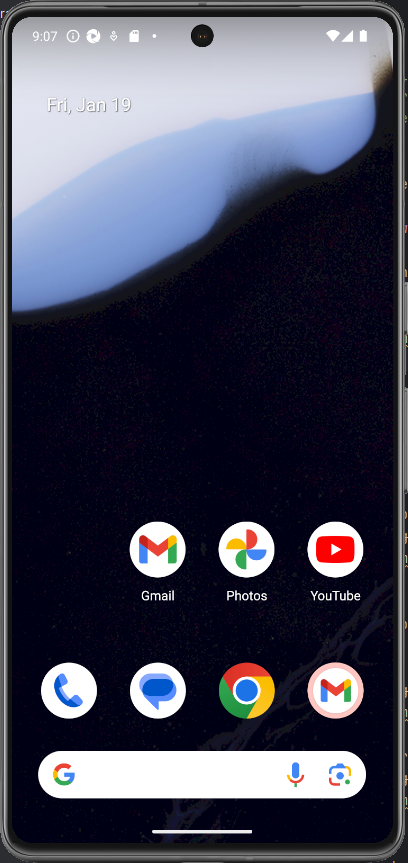
</p>

Open command line and run the following command:  
```
appium
```
This command creates an environment for virtual device management by autotests. The successful command's result is appeared URLs as shown below:
<p align="center">
    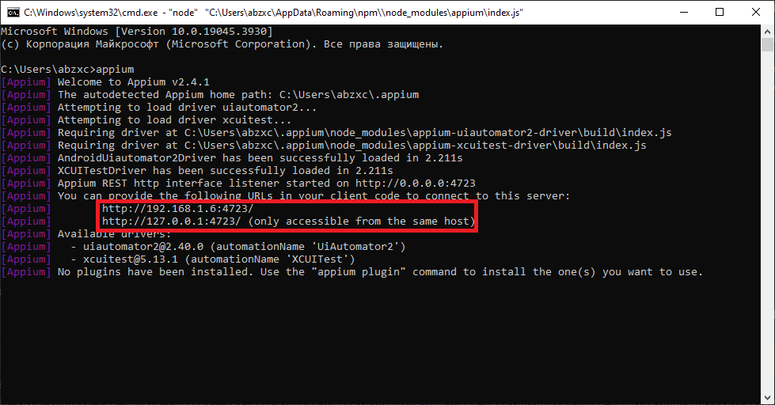
</p>

Open any downloaded project's file in PyCharm (right click on file -> Edit with PyCharm). There will be the following window:  
<p align="center">
    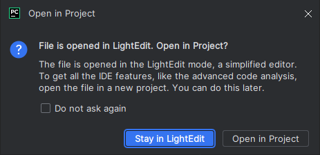
</p>

Click on **Open in Project**. After that there will be a following window:  
<p align="center">
    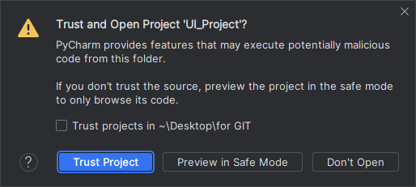
</p>

Click on **Trust Project**.  

Open a terminal in the opened PyCharm window by clicking on terminal button. The button locates at the bottom of the left sidebar as shown in the following figure:
<p align="center">
    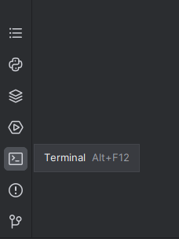
</p>
The terminal will open in the bottom of PyCharm as shown in the following figure:
<p align="center">
    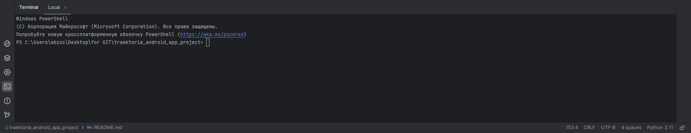
</p>

Launch tests using the following command:  
```
pytest --context=emulator
```

After running the command, tests will start in the opened virtual device. Tests process is provided below:  
<p align="center">
    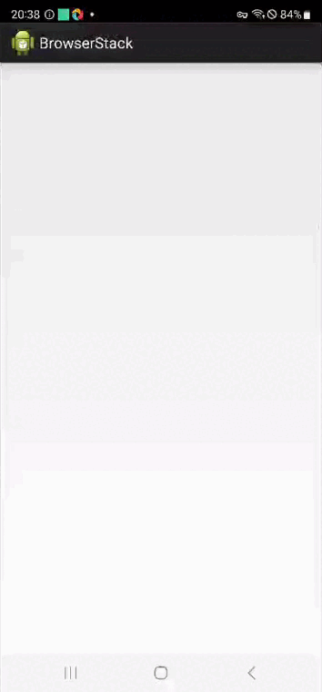  
</p>  

After the last step of tests (profile bar checking), the app will close on the virtual device. There will be tests result line in terminal when tests will finish. Its example:  
<p align="center">
    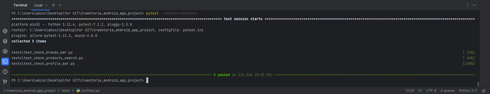
</p>

##### Search request managing
Search request used in products' search test can be set in terminal. It is possible with ```--search``` parameter. By default, the search request is "carhartt". For example, if you want to search "sk8mafia" products, run the following command:  
```
pytest --context=emulator --search=sk8mafia
```
Its command's tests process is provided below:  
<p align="center">
    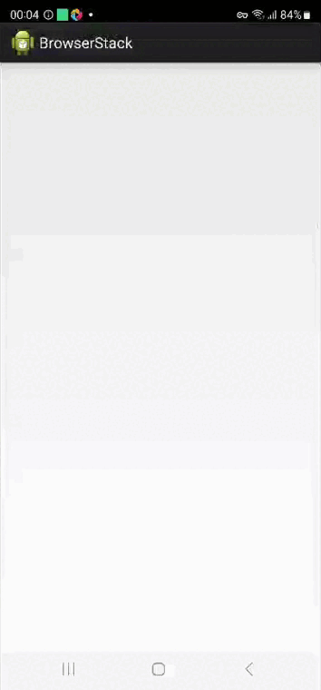  
</p>  

#### Generating a test report

Tests report is generated by Allure Report. To check it, run the following command after tests:  
```
allure serve allure-results
```  
After that, your system's default browser will open and there will be a [generated report](#allure-report).  

### Launch using Jenkins

Open this project on [Jenkins](https://jenkins.autotests.cloud/job/engovadzip_UI_project/). The project's page example is provided below.
<p align="center">
    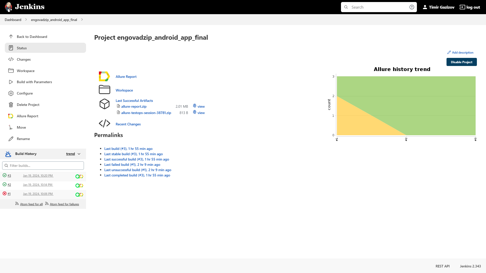  
</p>  

Click on "**Build with parameters**".  

<p align="center">
    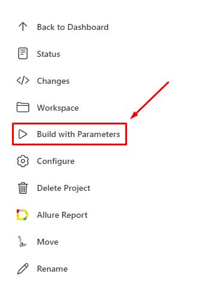  
</p>  

Set search request needed for products' search test in **SEARCH** string:
<p align="center">
    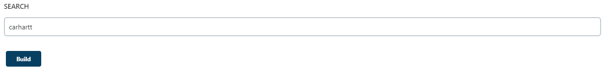  
</p>  

Click on "**Build**" button after choosing desired parameters. You will be redirected back on project's page after clicking on "**Build**". There will be a new build below "**Build History**" title as shown in the following figure:  
<p align="center">
    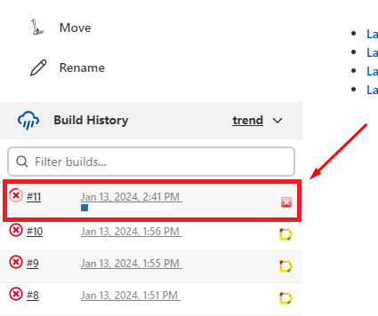  
</p>  

Build's status will change when tests will finish. And there will appear [TestOps](#testops-report) and [Allure](#allure-report) reports as shown in the following figure:  
<p align="center">
    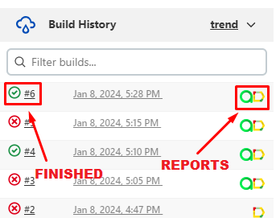  
</p>

## Tests results

### TestOps report
Go to [Jenkins project's page](https://jenkins.autotests.cloud/job/engovadzip_android_app_final/). Click on  in one of successful builds. Tests report is provided below:
<p align="center">
    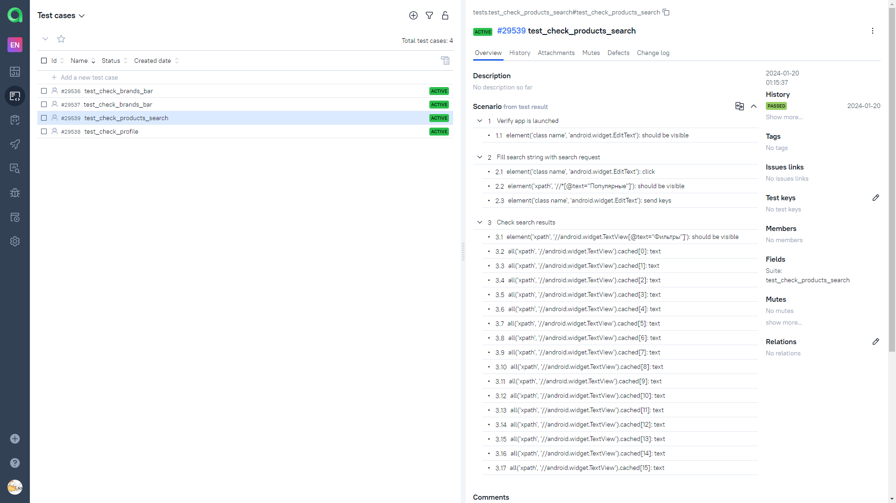  
</p>  

<p align="center">
    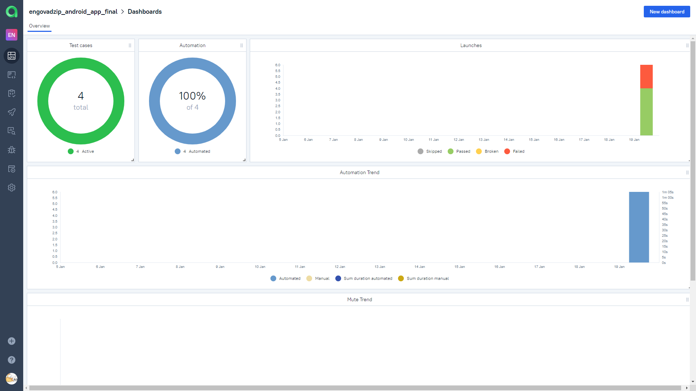  
</p>  

### Allure report

If you generate report locally, follow the [instruction](#generating-a-test-report). If you generate it on Jenkins, click on  in one of successful builds. Tests report from Jenkins is provided below:
<p align="center">
    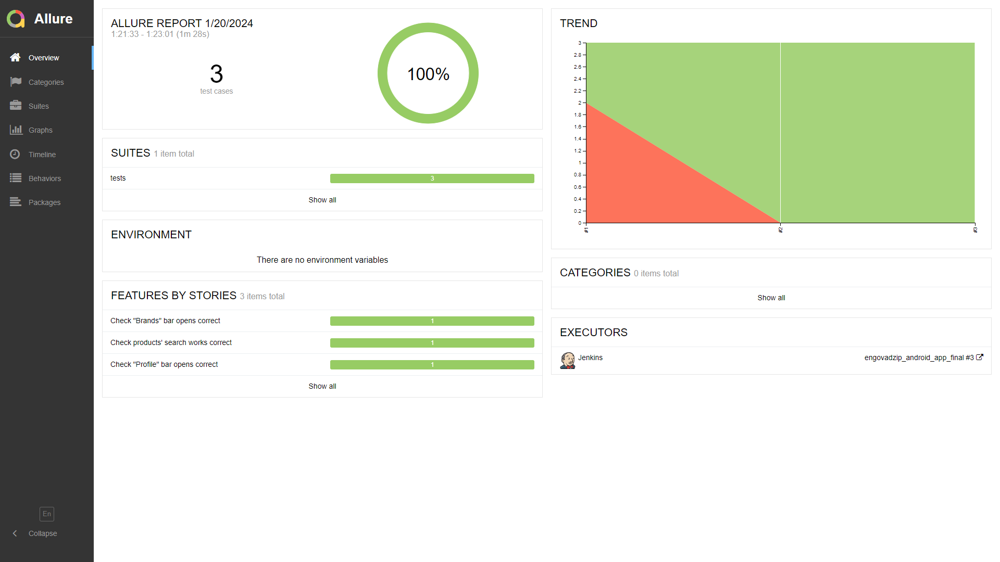  
</p>  

There will not be **TREND** in the report if you generate report locally. It will be in Jenkins only. 

### Telegram notification

After Jenkins' build will finish, Telegram Bot will send a notification with test results to Telegram chat. The chat is private. It is only for tests developer and responsible members. The notification is provided below:
<p align="center">
    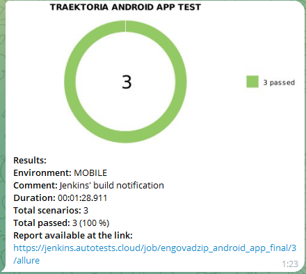  
</p>  
